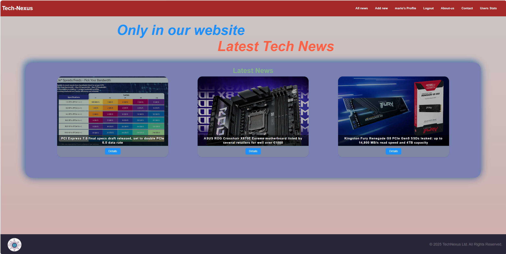
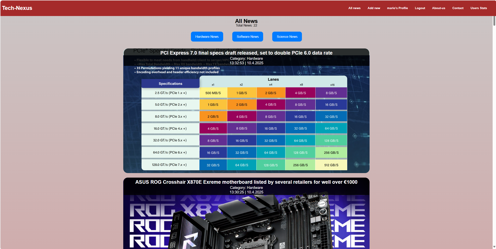
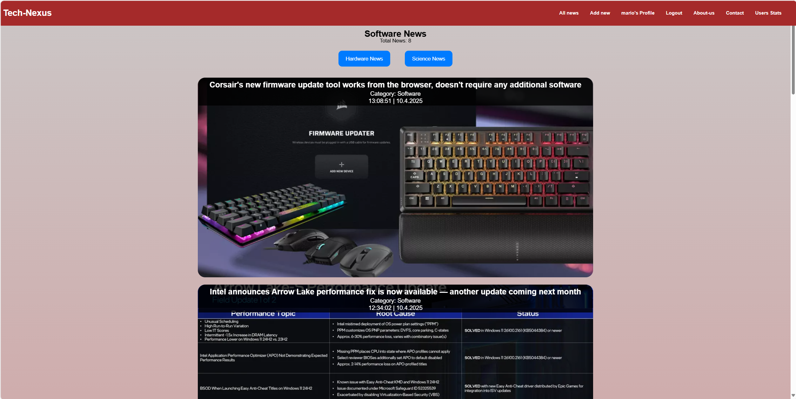
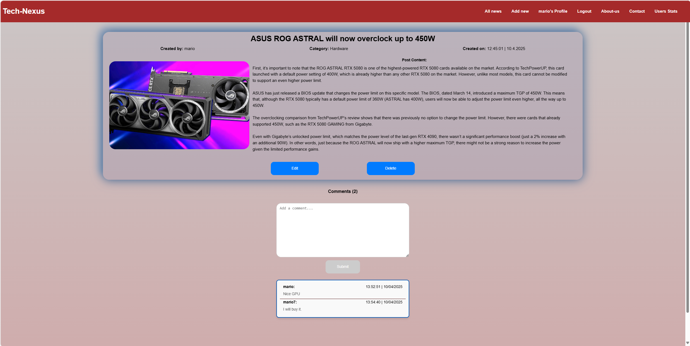
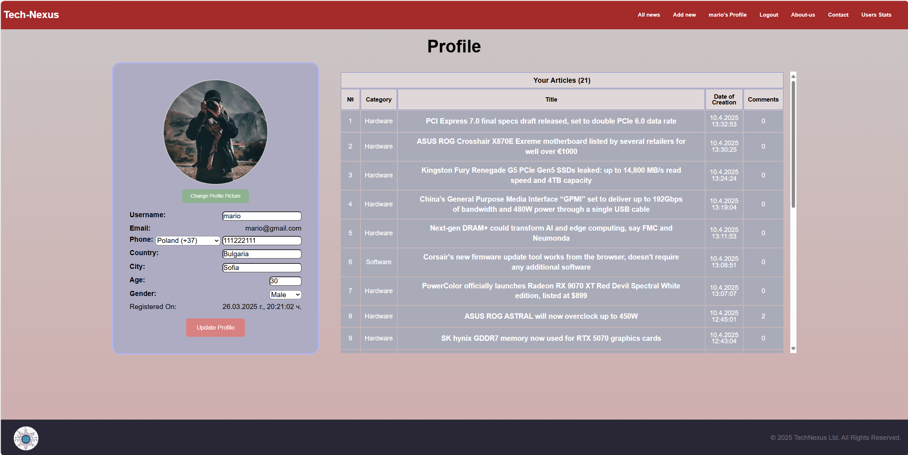
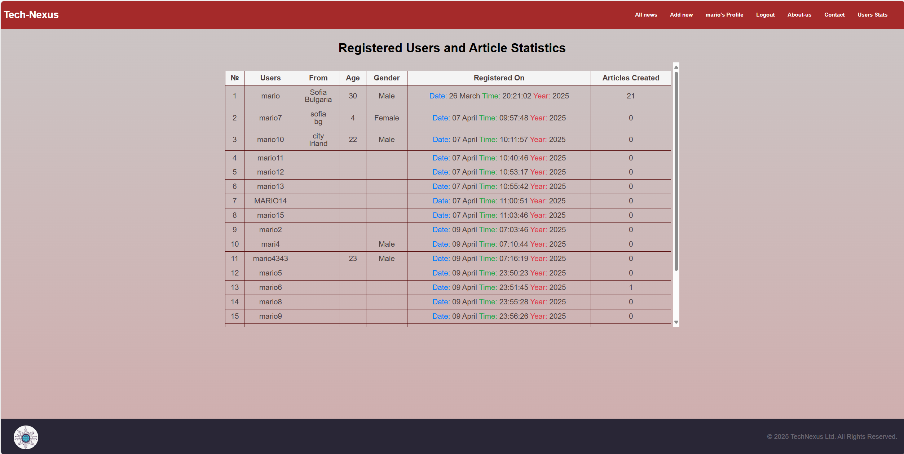

# Tech Nexus Project Documentation

## 🚀 Project Overview  
Tech Nexus is a tech news platform that enables users to read, create, edit, and delete categorized news articles. It also supports user comments, profile management, and user statistics, making it an interactive and user-friendly platform.

---

## **🌐 Deployment**
The Tech Nexus application is deployed and hosted on **Azure Static Web Apps**.  
**🔗 [Live App – Tech Nexus](https://lively-stone-0e8181303.6.azurestaticapps.net)**

---

## **⚙️ Tech Stack**

### **🧩 Frameworks & Libraries**
- **Frontend**: React (with Vite)
- **Backend**: Firebase
  - Firebase Authentication
  - Firestore Database
  - Firebase Storage (for images)
- **Styling**: CSS3 (Flexbox & Grid)
- **Additional Libraries**:
  - **EmailJS**: For sending emails in the contact form
  - **Icons**: FontAwesome

---

## **Functionality**

1. **🔐 Authentication**
   - User Registration and Login (Firebase Authentication)
   - Auth guards: only creators can edit/delete their own articles
   - Restricted access to profile, add-new, edit-article pages

2. **📰 Article System**
   - Browse articles categorized as Hardware, Software, and Science
   - Full article details with author info and comments
   - Create, Edit, and Delete articles (only by authors)

3. **💬 Comments**
   - Add and view comments under each article (add comments only for logged users)
   - Timestamp and username are displayed with comments.

4. **👤 Profile Management**
   - Update user details: username, picture, phone country code, phone number, country, city, age, gender
   - View a list of created articles "news"

5. **📊 User Stats**
   - View all users with number of articles, registration date, gender and location

6. **Additional Pages**
   - **📞 Contact Page**
    - Integrated EmailJS form to send messages
    - Google Maps location to display location
    - Personal info with icons (LinkedIn, GitHub, Phone, Email, Address)
   - **🧾 About Page**
    - Basic information about the platform

---

## **🛠️ How to Run the Project Locally**

### 1. **Clone the repository**
```bash
git clone https://github.com/MariusGeorgiev/React-Project-Tech-Nexus.git
```
or download like a zip
```
cd .\tech-nexus\
```

### 2. **Install dependencies**
```bash
npm install
```

### 3. **Start the app**
```bash
npm run dev
```

> Open in browser: [http://localhost:5173](http://localhost:5173)

---

## **🌍 Recommended Requirements**

Tech Nexus is tested and optimized for the following:

- **Display Resolution**: 
  - Works well on 16/10 **1680x1050** resolution with **67% browser scaling** 
  - Tested at 16/9 **1920x1080** resolution native with **100% scaling**
  - Tested at 16/9 **2560x1440** resolution with **110-115% windows scaling** and higher resolutions


- **Supported Browsers**: 
  - Google Chrome
  - Mozilla Firefox
  - Microsoft Edge
  - Safari (MacOS)

These configurations ensure the best user experience with optimal UI layout and performance. Other display resolutions and browsers may also work, but some layout or rendering issues may arise.

---

## **🗺️ Routes Overview**

### **Public Pages**
- `/` – Home
- `/login`, `/register`
- `/all-news`, `/software-articles`, `/hardware-articles`, `/science-articles`  
- `/details-article/:id`
- `/users-stats`
- `/about`, `/contact`
- `*` - 404 Not Found (any undefined route)

### **Private (Auth Required)**
- `/add-new`  
- `/edit-article/:id`  
- `/profile/:userId`

---

## **🖼️ Screenshots**

### **Home Page**


### **All News Page**


### **Software News Page**


### **Details Article**


### **Profile Page**


### **User Stats**


---

## **🔮 Future Improvements**
- Add pagination for large news feeds
- Implement Like/Dislike system for articles and comments
- Add **dual language support** (English and Bulgarian) to improve accessibility to a broader audience
- Introduce dark mode for better user experience
- Notifications for new comments on articles

---

## **📜 License**
This project is licensed under the MIT License.
